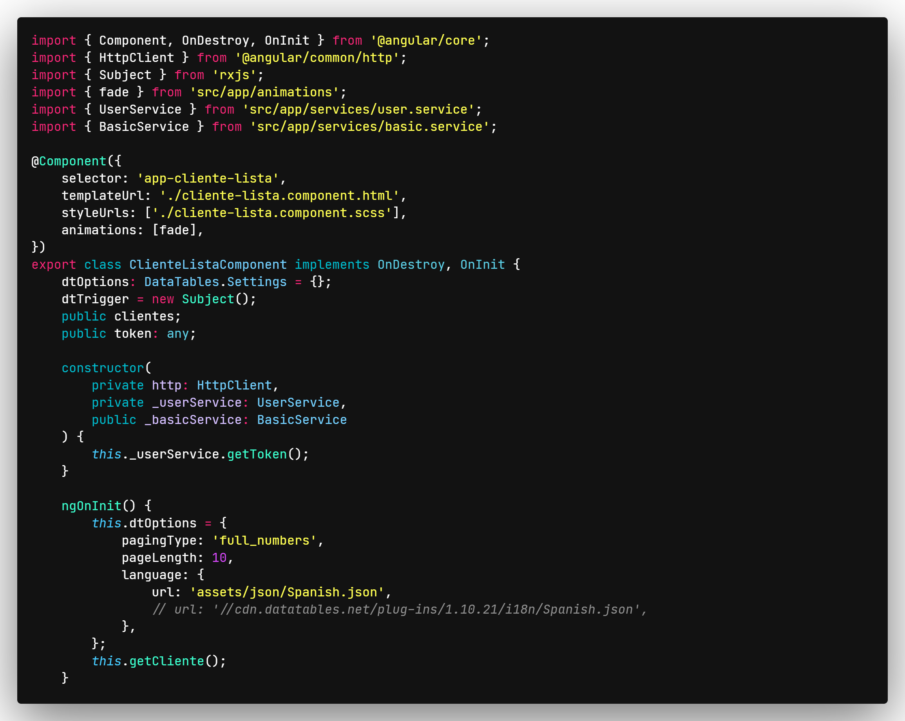

# Dsmoke-Dark

## _Bienvenidos_

El tema consta de colores oscuros con detalles en colores llamativos para poder tener una mayor atencion, destacando el color rojo como color princial.

## Colores Dark

-   [Visual Studio Code's Extension](https://marketplace.visualstudio.com/publishers/theme-dsmoke-dark)

**Gracias**
